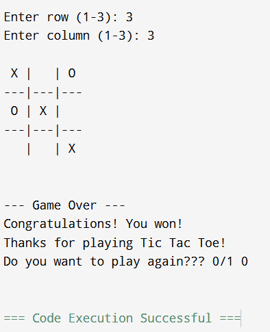

# Tic Tac Toe Game (C++)

## Overview
This project is a **console-based Tic Tac Toe game** implemented in **C++**.  
It allows two players to play the classic Tic Tac Toe game by taking turns on a 3×3 grid. The program validates user input, updates the game board after every move, and determines the game outcome (win or draw).

This project demonstrates **basic game logic, control flow, and array manipulation** in C++.


## Tech Stack
- **Language:** C++
- **Concepts Used:**
  - Arrays
  - Loops
  - Conditional statements
  - Functions
  - Input validation


## Features
- Two-player gameplay (Player X and Player O)
- Real-time board display after each move
- Validation for invalid or already occupied positions
- Automatic win detection (rows, columns, diagonals)
- Draw detection when the board is full and no player wins
- Simple and user-friendly console interface

## Output Screenshots

### Output 1


### Output 2


### 1️⃣ Compile and run the program
```bash
g++ tic-tac-toe.cpp -o tic-tac-toe
./tic_tac_toe

